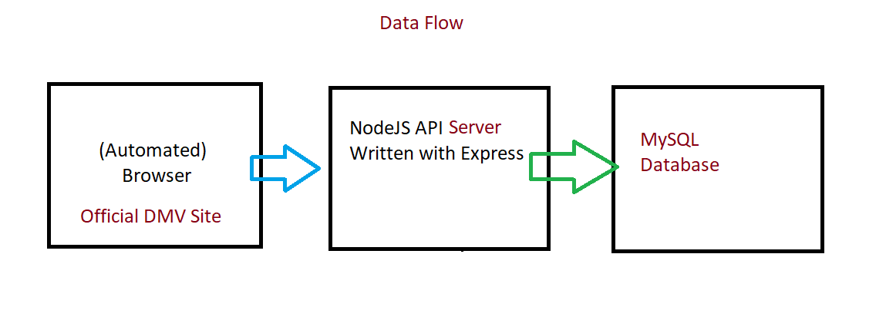
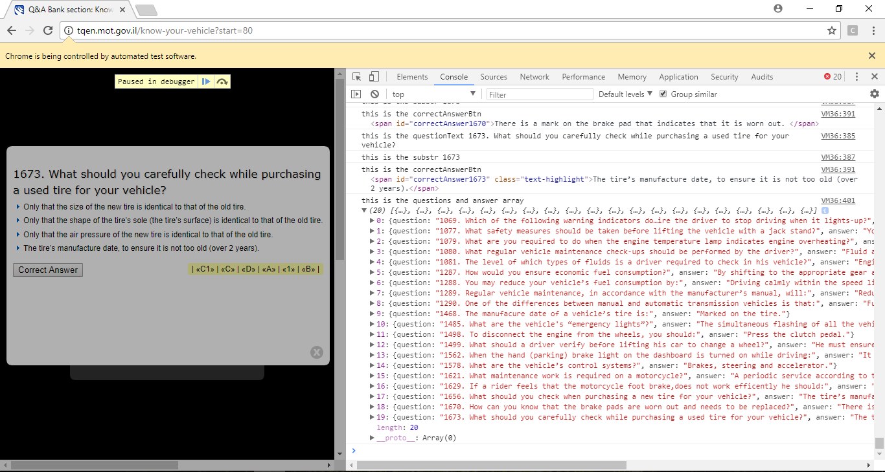

This repo contains all the code you need to get started scraping websites and saving the data to a MySQL Database.


Table of Contents for this Repo:

- [Technologies - and How It Works](#technologies)
- [Getting Started](#getting-started)
- [Integrating with Webdriver IO](#integrating-with-webdriverio)
- [Once All Data is Fetched](#once-all-data-is-fetched)
- [Metabase API Integration](#metabase-api-integration)


Technologies
--------

The project includes a long list of technologies, including:



- MySQL
- Vanilla Javascript (specifically the setInterval Function)
- Support for WebdriverIO and WebdriverIO Page Objects
- NodeJS / Express Server 

<br>

The Saving Process begins with the file in <a href="https://github.com/ElishaKay/scraping-the-driving-questions/blob/master/test/specs/saveQuestions.js">'test/specs/saveQuestions.js'</a>

Once the JavaScript code of that page is injected into the browser (either manually or via WebdriverIO), this is the data that is logged in the Console. The QandAObject contains the question, answer, section, and image source url when available.

<br>



<br>

Getting Started
---------------

The easiest way to get started is to clone the repository:

```bash
# Get the latest snapshot
git clone https://github.com/ElishaKay/scraping-the-driving-questions

# Change directory
cd scraping-the-driving-questions

# Install NPM dependencies
npm install

# Or, if you prefer to use `yarn` instead of `npm`
yarn install

```

Next, we need to set up our MySQL Database.

Step 1: Using Xampp, or any other MySQL Client, create a database - with any name.

Step 2: Import the <a href="https://github.com/ElishaKay/scraping-the-driving-questions/blob/master/database.sql">database.sql</a> file into your database - or just copy-paste that text into your SQL Command Query Runner. That will create the neccessary tables for the app to work.

Step 3: Add a .env file to your root directory that includes MySQL Creds - should look like this:


```bash
HOST=the.ip.goes.here (could also be localhost)	
DATABASE=yourdbname
USER=username
PASSWORD=thepassword

```


Once, you've achieved that, Then simply start your app

```
node server.js 

or:

nodemon server.js
```


**Note:** I highly recommend installing [Nodemon](https://github.com/remy/nodemon).
It watches for any changes in your  node.js app and automatically restarts the
server. Once installed, instead of `node app.js` use `nodemon app.js`. It will
save you a lot of time in the long run, because you won't need to manually
restart the server each time you make a small change in code. To install, run
`sudo npm install -g nodemon`.

<br>


Integrating With WebdriverIO
---------------

Once your MySQL DB and Express Server are running (see directions directly above), you can automated the data-fetching process with WebdriverIO, an NPM Testing Library. The repo contains support for webdriverio page objects which could help you keep your DOM Selectors organized when your test becomes bigger.

Because this is such a small project, we're not using WebdriverIO's page objects structure. Instead, we're using vanilla JS's setInterval function to loop through each question, open it up, and send the qAndAobject to MySQL via the jQuery .Post Command.

WebdriverIO has an ExecuteJavaScript Function which injects your JS directly into the browser that it opens up for you.


Step 1: Visit this page which shows you how to <a href="http://www.webdriverjs.com/a-basic-example-for-webdriverio-test/">install and run selenium-standalone in the background</a>

Here's a Cheat Sheet of Commands for setting up Selenium Standalone Server (which will listen for commands from WebdriverIO):

From any location, run the below command in CommandPrompt/Terminal to install selenium server utility.
```
npm install -g selenium-standalone
```

Run the below command in CommandPrompt/Terminal to update selenium standalone server and browser drivers to latest versions.
```
selenium-standalone install
```

Run the below command in CommandPrompt/Terminal to run selenium server.
```
selenium-standalone start
```

Open a new CommandPrompt/Terminal and run the below command to execute WebdriverIo test.
```
node ./test/specs/saveQuestion.js
```

You should see a browser opened and navigating to <a href="http://tqen.mot.gov.il/know-your-vehicle/vehicles-motorcycles">the Israeli DMV Site</a> which includes the Questions and Answers to the Driving Test. The Browser will now start sending questions to the express Server, which will then pass it on to the MySQL Database.

The MySQL DB uses the Question_ID as the Primary key. Meaning, if the question_id already exists in the DB, the NodeJS Server will simply log the error and continue running (without saving the question twice).

The Server Logic is located at <a href="https://github.com/ElishaKay/scraping-the-driving-questions/blob/master/server.js>">server.js</a>

<br>

Once All Data is Fetched
---------------


After all the questions have been fetched, run this DB Query to delete the img records that equal "www.pizzahut.com"

```
UPDATE question SET img = null WHERE img="www.pizzahut.com"
```

If you'd like to display all the data you've saved in a nice format, feel free to check out this <a href="https://github.com/ElishaKay/driving-test-ebook-store">MySQL-Node-Angular Site I built to stylishly-display the driving-test study data.</a>

<br>

Metabase API Integration
---------------

Metabase is an Open-Source Data Visualization Platfrom that allows you to sync your Database and run and share SQL Queries in the Cloud.

The results of the DB queries you write can then be shared on the public web with anybody via these convenient links.

Here are some examples of the Metabase API integrated with this Repo's project (you can export data to json, csc, and xlsx).

API: https://cms-dashboard.herokuapp.com/api/public/card/20a2647f-2872-4abb-8270-164711e3e6ae/query?parameters=[{"type":"category","target":["variable",["template-tag","access_code"]],"value":"4"},{"type":"category","target":["variable",["template-tag","days"]],"value":"10"}]

Export JSON: https://cms-dashboard.herokuapp.com/api/public/card/20a2647f-2872-4abb-8270-164711e3e6ae/query/json?parameters=[{"type":"category","target":["variable",["template-tag","access_code"]],"value":"3"},{"type":"category","target":["variable",["template-tag","days"]],"value":"10"}]

Export CSV: https://cms-dashboard.herokuapp.com/api/public/card/20a2647f-2872-4abb-8270-164711e3e6ae/query/csv?parameters=[{"type":"category","target":["variable",["template-tag","access_code"]],"value":"4"},{"type":"category","target":["variable",["template-tag","days"]],"value":"10"}]


Here are some other pages that could help you in your Data Gathering Journey:

<a href="https://medium.com/@acoyfellow/mass-linkedin-request-without-3rd-party-software-dff998aedd23">Template for Social Media Automation</a>